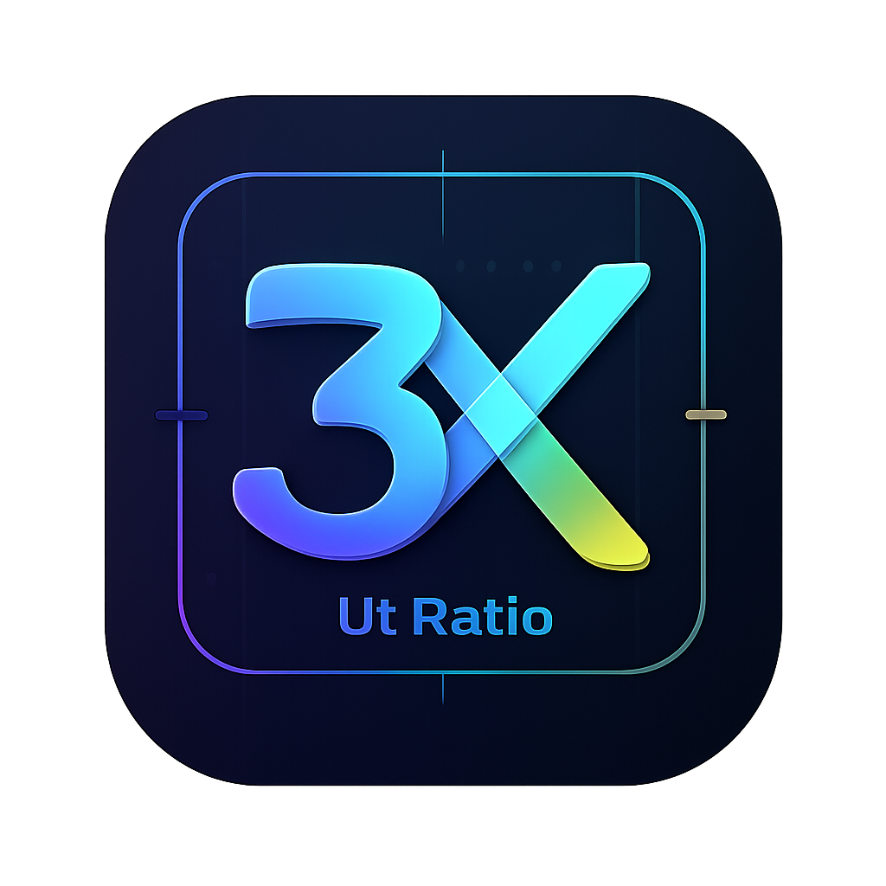

<div align="center" dir="rtl">



# 3X-UI Ratio

### مدیریت مستقل حجم 3X-UI

[](https://github.com/rezakhosh78/3x-ui-Ratio/releases)
[](LICENSE)
[](#-نصب)
[](https://t.me/pingplas_channel)

[فارسی](README_FA.md) · [English](README.md)

</div>

---

<div dir="rtl">

## 📌 معرفی

**3X-UI Ratio** یک پنل مستقل برای مدیریت حجم کاربران 3X-UI است.

این برنامه فهرست کاربران را از API پنل 3X-UI دریافت می‌کند،، حجم‌های تعریف‌شده را در دیتابیس مستقل خودش نگه می‌دارد و در صورت پایان حجم، کاربر را از طریق API رسمی 3X-UI غیرفعال می‌کند.

> 3X-UI Ratio هیچ تغییری را به‌صورت مستقیم روی دیتابیس 3X-UI انجام نمی‌دهد.

---

## ✨ امکانات

- 👥 دریافت و همگام‌سازی کاربران 3X-UI
- 📊 نمایش مصرف با نمودار پرشونده و رنگی
- 🎯 تعریف حجم مستقل برای هر کاربر
- 📴 غیرفعال‌کردن خودکار کاربر پس از پایان حجم
- ▶️ روشن و خاموش‌کردن Enforcement
- ⏸️ کلید سراسری Ratio ON/OFF
- ☑️ انتخاب چندتایی کاربران و اعمال حجم مشترک
- 🔄 همگام‌سازی خودکار با حداقل بازه ۱۰ ثانیه
- 🧹 آرشیو کاربران حذف‌شده بدون ازبین‌رفتن سابقه
- 💾 دانلود Backup دیتابیس از Web UI
- 📥 Import و Restore فایل Backup
- 📝 گزارش عملیات و Logs
- 🌐 رابط فارسی و انگلیسی
- 🌙 تم روشن و تیره
- 📱 رابط واکنش‌گرا با پشتیبانی RTL و LTR
- 🐳 نصب مبتنی بر Docker
- 🛠️ دستور مدیریتی `3xui-ratio`

---

## 🧩 نحوه عملکرد

```text
API پنل 3X-UI
   │
   ├── دریافت فهرست و وضعیت کاربران
   │
   ▼
3X-UI Ratio
   │
   ├── دیتابیس مستقل حجم‌ها
   ├── زمان‌بندی و اجرای محدودیت حجم
   │
   ▼
API پنل 3X-UI
   └── غیرفعال‌کردن کاربر پس از پایان حجم
```

مصرف کاربر از هدر لینک ساب محاسبه می‌شود:

```text
upload + download = used traffic
```

حجمی که در Ratio تعیین می‌شود از حجم تعریف‌شده در پنل 3X-UI مستقل است.

---

## ✅ پیش‌نیازها

محیط پیشنهادی:

- Ubuntu 20.04، 22.04 یا 24.04
- دسترسی Root یا `sudo`
- دسترسی اینترنت
- پنل 3X-UI قابل دسترس
- توکن API یا اطلاعات ورود پنل
- فعال‌بودن سرویس Subscription در 3X-UI

در صورت نیاز، نصب‌کننده می‌تواند Docker و Docker Compose را نصب کند.

---

## 🚀 نصب یک‌خطی

با دسترسی Root اجرا کن:

```bash
bash <(curl -Ls https://raw.githubusercontent.com/rezakhosh78/3x-ui-Ratio/main/install.sh)
```

روش جایگزین با `sudo`:

```bash
sudo bash -c "$(curl -fsSL https://raw.githubusercontent.com/rezakhosh78/3x-ui-Ratio/main/install.sh)"
```

> اگر شاخه اصلی مخزن شما `main` نیست، نام شاخه صحیح را در لینک جایگزین کن.

---

## 📦 نصب دستی

آخرین فایل `tar.gz` را از صفحه [Releases](https://github.com/rezakhosh78/3x-ui-Ratio/releases) دانلود کن و اجرا کن:

```bash
unzip 3X-UI-Ratio.zip
cd 3xui-ratio
sudo bash install.sh
```

نصب‌کننده اطلاعات زیر را دریافت می‌کند:

- پورت Web UI
- نام کاربری مدیر
- رمز عبور مدیر
- تنظیم Secure Cookie
- منبع اختیاری آپدیت

---

## 🖥️ مدیریت از ترمینال

پس از نصب اجرا کن:

```bash
sudo 3xui-ratio
```

منوی مدیریتی شامل این موارد است:

```text
1) Service status
2) Start service
3) Stop service
4) Restart service
5) Live logs
6) Create full backup
7) Update panel
8) Edit installation settings
9) Show version
10) Uninstall completely
0) Exit
```

فرمان‌های مستقیم:

```bash
sudo 3xui-ratio status
sudo 3xui-ratio start
sudo 3xui-ratio stop
sudo 3xui-ratio restart
sudo 3xui-ratio logs
sudo 3xui-ratio backup
sudo 3xui-ratio update
sudo 3xui-ratio uninstall
```

---

## 🔗 اتصال به 3X-UI

در Web UI وارد بخش **Connection** شو و آدرس کامل پنل را همراه با WebBasePath وارد کن.

مثال:

```text
https://panel.example.com:8443/your-web-base-path
```

تا زمانی که نصب خاص شما نیاز نداشته باشد، `/panel/api` را دستی به انتهای آدرس اضافه نکن.

### آدرس پایه Subscription

آدرس سرویس Subscription را بدون `subId` کاربر وارد کن.

مثال:

```text
https://subscription.example.com/sub
```

Ratio شناسه `subId` را به‌صورت خودکار اضافه می‌کند:

```text
https://subscription.example.com/sub/CLIENT_SUB_ID
```

---

## 🎯 اجرای محدودیت حجم

برای هر کاربر می‌توانی:

- حجم تعیین یا ویرایش کنی
- چرخه مصرف را ریست کنی
- Enforcement را روشن کنی
- Enforcement را متوقف کنی
- کاربر را در 3X-UI روشن یا خاموش کنی

وقتی Enforcement فعال باشد:

```text
used traffic >= Ratio quota
```

Ratio وضعیت کاربر را دوباره بررسی می‌کند و درخواست غیرفعال‌سازی را از طریق API پنل ارسال می‌کند.

### کنترل‌های سراسری

- **Ratio ON/OFF:** توقف یا ادامه همه عملکردهای اجرایی
- **Stop All Enforcement:** توقف Enforcement بدون خاموش‌کردن کاربران 3X-UI
- **Start Enforcement:** روشن‌کردن Enforcement برای کاربران انتخاب‌شده دارای Quota

---

## 💾 پشتیبان‌گیری و بازیابی

بخش **Backup & Restore** این امکانات را دارد:

- ساخت و دانلود Snapshot دیتابیس
- Import فایل‌های `.db`، `.sqlite` و `.sqlite3`
- بررسی سلامت SQLite پیش از Restore
- ساخت Restore Point خودکار پیش از جایگزینی

Backup شامل این موارد است:

- تنظیمات اتصال
- کاربران مدیریت‌شده
- حجم‌ها
- چرخه‌های مصرف
- تنظیمات برنامه
- Logs
- Audit History

> فایل Backup را در محل امن نگه دار؛ ممکن است شامل اطلاعات عملیاتی و اطلاعات اتصال رمزنگاری‌شده باشد.

---

## 🔄 آپدیت

برای آپدیت از دستور زیر استفاده کن:

```bash
sudo 3xui-ratio update
```

یا مسیر فایل نسخه جدید را وارد کن:

```bash
sudo 3xui-ratio update /root/3X-UI-Ratio-latest.zip
```

پیش از جایگزینی فایل‌ها، یک Backup خودکار ساخته می‌شود.

---

## 🗑️ حذف کامل

اجرا کن:

```bash
sudo 3xui-ratio uninstall
```

حذف کامل فقط پس از تأیید صریح انجام می‌شود.

ممکن است Backupها در مسیر زیر باقی بمانند:

```text
/var/backups/3xui-ratio
```

فقط زمانی آن‌ها را دستی حذف کن که دیگر موردنیاز نیستند.

---

## 🔐 نکات امنیتی

- برای Web UI و پنل 3X-UI تا حد امکان از HTTPS استفاده کن.
- رمز عبور قوی برای مدیر تعیین کن.
- API Token، Cookie، فایل Backup و `.env` را منتشر نکن.
- دسترسی پورت Web UI را با Firewall یا Reverse Proxy محدود کن.
- Ratio و پنل 3X-UI را به‌روز نگه دار.
- ابتدا Enforcement را روی یک کاربر آزمایشی بررسی کن.
- پس از تغییر API یا Subscription، Logs را بررسی کن.

---

## 🧯 رفع اشکال

### هیچ Endpoint سازگاری پیدا نشد

موارد زیر را بررسی کن:

- آدرس پنل و WebBasePath
- تفاوت HTTP و HTTPS
- توکن API یا اطلاعات ورود
- تنظیمات Reverse Proxy
- در دسترس بودن API پنل

### لینک Subscription خطای HTTP 404 می‌دهد

موارد زیر را بررسی کن:

- سرویس Subscription فعال باشد
- دامنه و پورت Subscription صحیح باشد
- آدرس پایه شامل `subId` کاربر نباشد
- کاربر `subId` معتبر داشته باشد
- Reverse Proxy مسیر `/sub/...` را عبور دهد

### همگام‌سازی خودکار با تأخیر انجام می‌شود

لاگ را بررسی کن:

```bash
sudo 3xui-ratio logs
```

همچنین مطمئن شو:

- Ratio روشن باشد
- Polling Interval حداقل ۱۰ ثانیه باشد
- درخواست‌های Subscription Timeout نشوند
- ساعت سرور صحیح باشد
- کانتینر در حال اجرا باشد

---

## 🛣️ برنامه توسعه

- 📈 نمودار تاریخچه مصرف
- 🔔 اعلان تلگرام
- 🧑‍💼 چند حساب مدیریتی
- 🧩 اتصال هم‌زمان به چند پنل 3X-UI
- 📤 خروجی CSV
- 🗓️ سیاست‌های زمان‌بندی‌شده ریست حجم
- 🔐 روش‌های احراز هویت بیشتر

---

---

## 📣 لینک‌ها

- 🐙 گیت‌هاب: [3X-UI Ratio](https://github.com/rezakhosh78/3x-ui-Ratio)
- ✈️ تلگرام: [کانال Ping Plus](https://t.me/pingplas_channel)
- 📦 دانلود نسخه‌ها: [Releases](https://github.com/rezakhosh78/3x-ui-Ratio/releases)
- 🐛 گزارش مشکل: [Issues](https://github.com/rezakhosh78/3x-ui-Ratio/issues)

---

## ⚖️ سلب مسئولیت

این پروژه یک ابزار مدیریتی مستقل است و بخشی رسمی از پروژه 3X-UI محسوب نمی‌شود.

مسئولیت موارد زیر بر عهده استفاده‌کننده است:

- ایمن‌سازی سرور
- محافظت از اطلاعات ورود و Backupها
- بررسی سازگاری API
- آزمایش Enforcement
- رعایت قوانین و مقررات مربوط

---

<div align="center">

### Powered By ReZa Kh

⭐ اگر این پروژه برایت مفید بود، در GitHub به آن Star بده.

</div>

</div>
